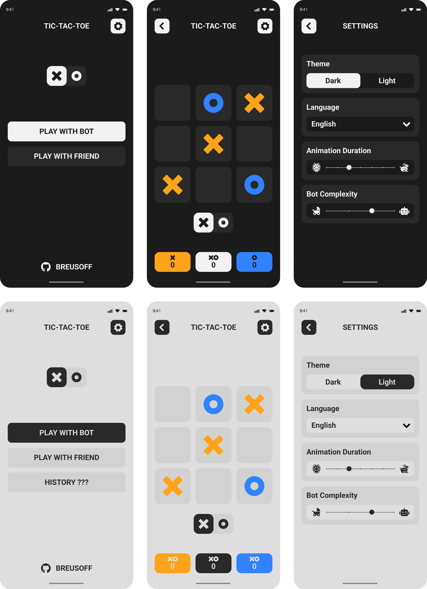

# TIC TAC TOE

Крестики-нолики — логическая игра между двумя противниками на квадратном поле 3 на 3

## Дизайн

## Особенности

- TypeScript, Styled Components
- Локализация i18n
- Смена активной темы
- Роутинг
